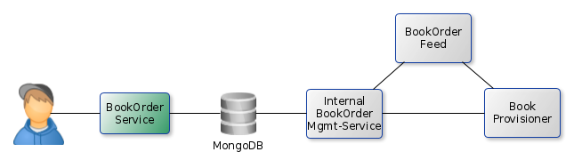

ContainerLinking
==

This demo show how to link multiple containers and how to use a directory on the host to store some information.

Requirements
--

  * JDK 7+

Usecase
--

The idea behind this demo is a simple book store, that exposes an external service (via rest and as a website) to request a new book. This service is realized via Tyche.

The request is then stored in a mongo db and read by a second component that will expose the requests to internal consumers via a rest service. Additionally all new requests are published via an atom feed. The first component is realized via Pherousa, the atom feed is provided via [Atomhopper](http://atomhopper.org/).

The last component is a workflow engine that takes the requests and starts all the required processes to fulfill the customers request. This is realized in Typhon.
 

Usage
--

Start the demo via demoStart.sh. The script will take care for creating the required images, building the projects and starting all containers in the propper order.

After startup you can access

  * Typhon via [http://localhost:18080](http://localhost:18080)
  * Pherousa via [http://localhost:18081](http://localhost:18080)
  * The atom feed via [http://localhost:18082/atomhopper//bookorder/feed](http://localhost:18082/atomhopper//bookorder/feed)
  

_Hint_ Typhon doesn't provide a user interface, it only logs all new requests into the logfile. The logfile is written to /tmp/Typhon.log.
